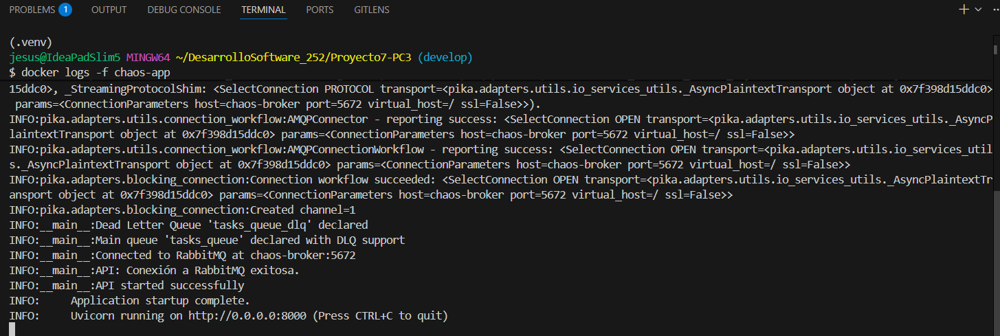
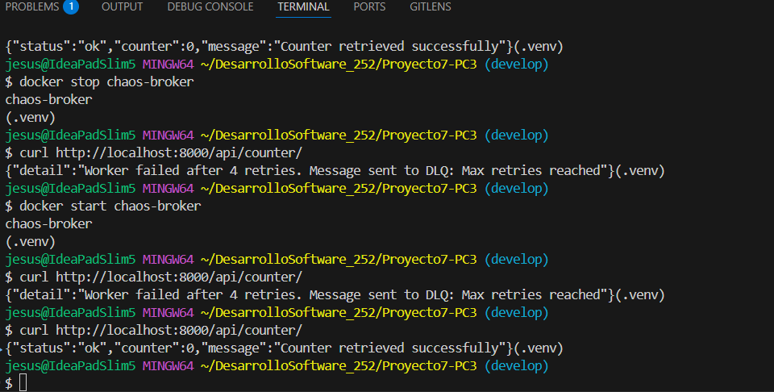
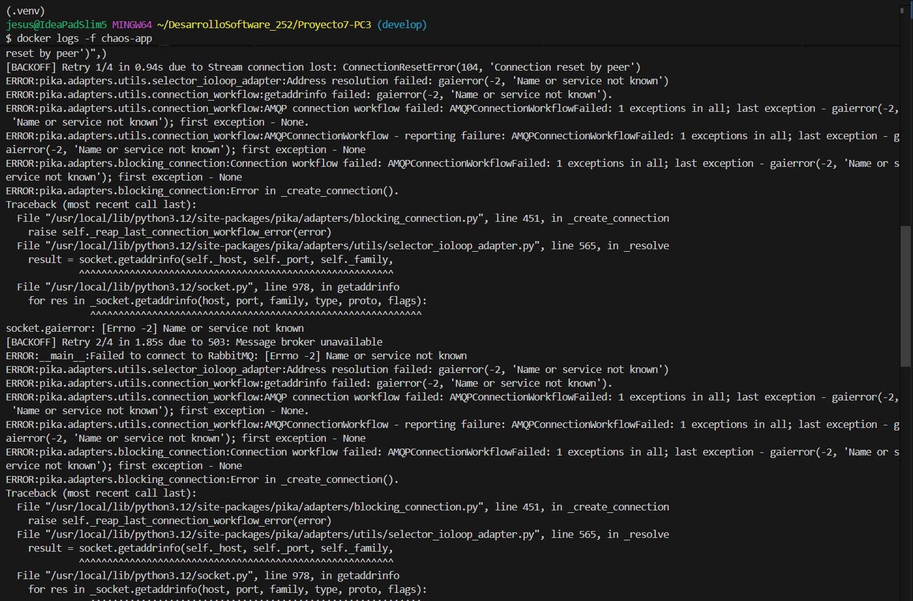
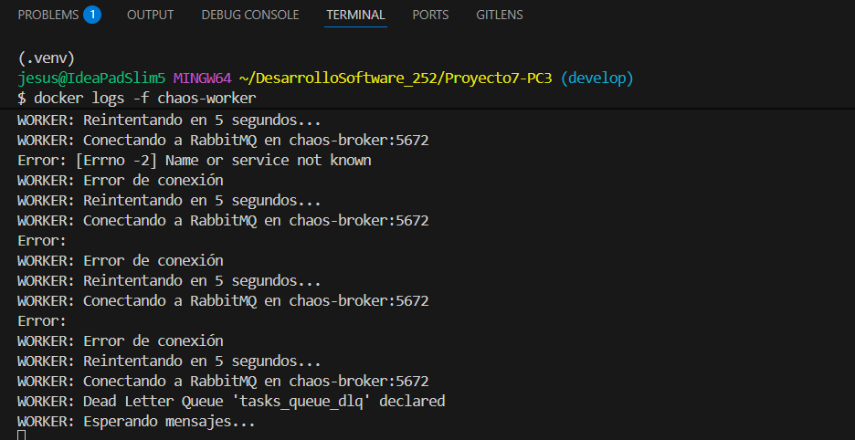
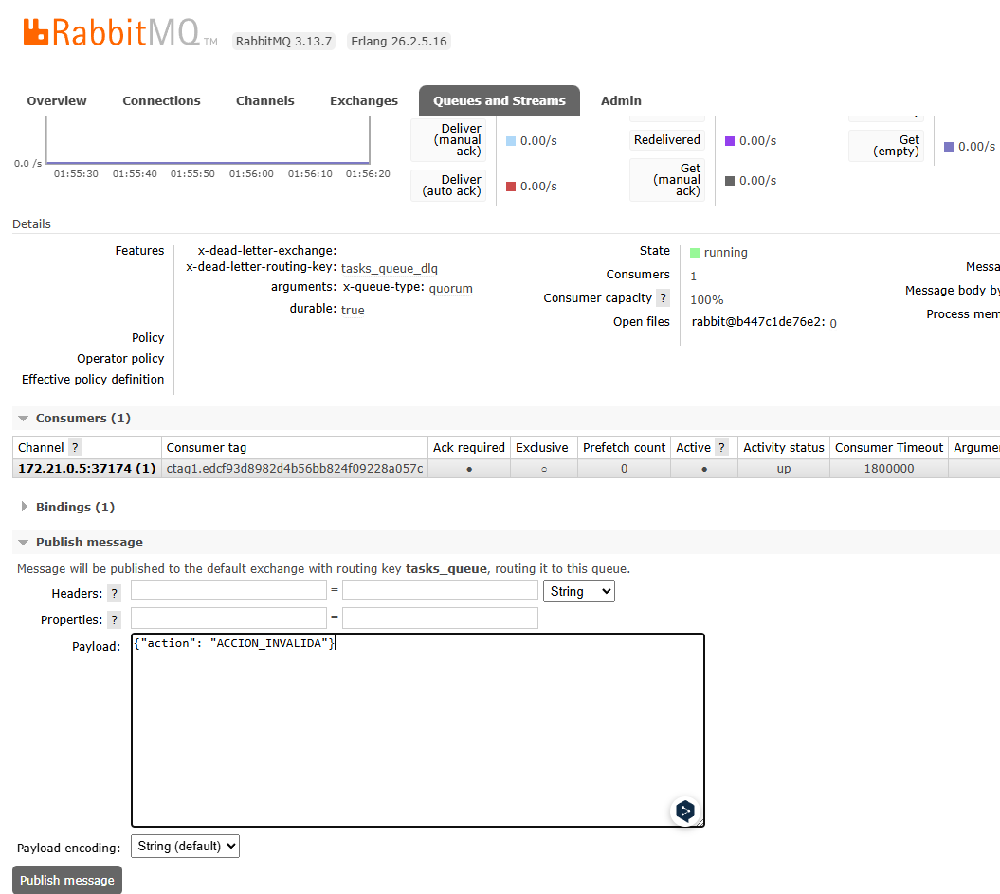
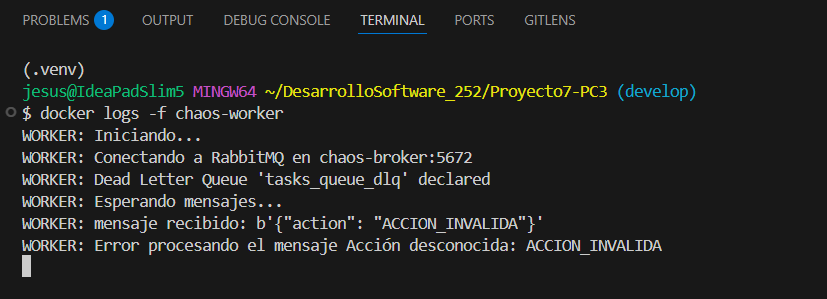
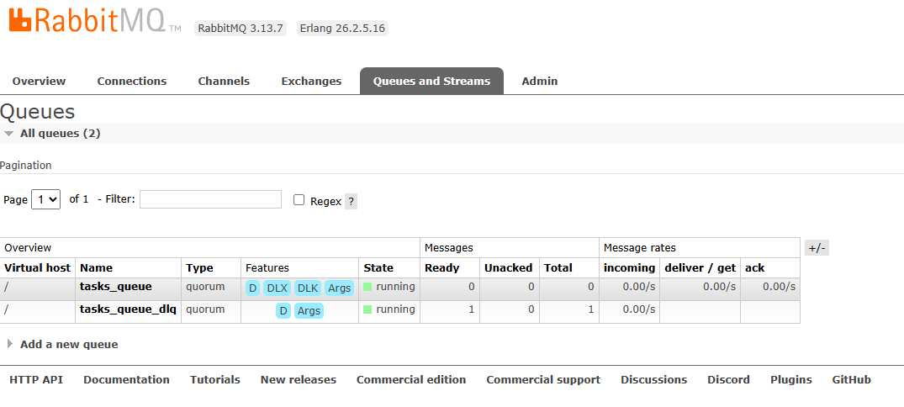
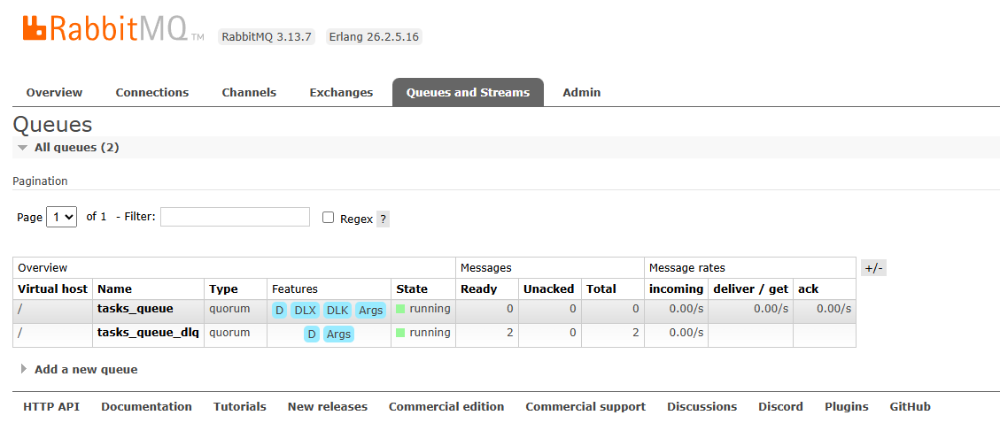

# Experimentos

## 1. Medir resiliencia ante reinicio del RabbitMQ

- Sistema saludable

    

    - La API (`chaos-app`) arranca y se conecta exitosamente a chaos-broker:5672.

    

    - La 1ra línea que es el primer `curl` a `/api/counter/` funciona y devuelve un `200 OK` (`{"status":"ok","counter":0...}`)

- Inyección de caos y falla controlada

    

    - Paramos el contenedor del broker con `docker stop chaos-broker`.

    

    - La conexión de la API se rompe (`ConnectionResetError`). En el siguiente intento de `curl`, la API no puede encontrar el host (`gaierror(-2, 'Name or service not known')`) y activa su lógica de reintentos (`[BACKOFF] Retry 1/4...`). Esto prueba que nuestra resiliencia si funciona.

    

    - El Worker también pierde la conexión y falla (`[Errno -2] Name or service not known`). Inmediatamente activa su bucle de reconexión: `WORKER: Error de conexión`... `WORKER: Reintentando en 5 segundos...`. Esto prueba que la lógica de arranque resiliente que implementamos funciona.

- Recuperación automática del sistema

    

    - Iniciamos nuevamente el contenedor del broker con `ocker start chaos-broker`

    

    - Después de "Reintentando", el worker finalmente se reconecta y declara sus colas, terminando en `WORKER: Esperando mensajes...`. El worker se recuperó solo.

    

    - El curl final (después de uno o dos intentos fallidos mientras el sistema se estabilizaba) vuelve a funcionar y devuelve `{"status":"ok","counter":0...}`. El sistema completo está operativo de nuevo, sin intervención manual en el código.

## 2. Verificar enrutamiento a la DLQ

- Inyección 

    

    - Inyectamos manualmente un mensaje erróneo con una {"action": "ACCION_INVALIDA"} en la tasks_queue.

- Detección

    

    - Los logs del worker (`docker logs -f chaos-worker`) muestran que:

        - Recibió el mensaje.

        - El `CommandFactory` falló correctamente.

        - El `try...except` capturó el error y lo registró: `Error procesando el mensaje Acción desconocida: ACCION_INVALIDA`.

- Captura de la cola DLQ

    La UI de RabbitMQ muestra el resultado final:

    

    - Vemos que al inicio la cola `tasks_queue_dlq` tiene un mensaje cargado.

    

    Y luego de mandar el mensaje erroneo, la cola `tasks_queue` sigue en cero mensajes y `tasks_queue_dlq` aumentó en un mensaje.  

    Esto prueba que la lógica de `basic_nack(requeue=False)` funcionó. El worker le dijo a RabbitMQ: "Este mensaje está mal, no lo reintentes", y RabbitMQ lo movió exitosamente a la DLQ.

    